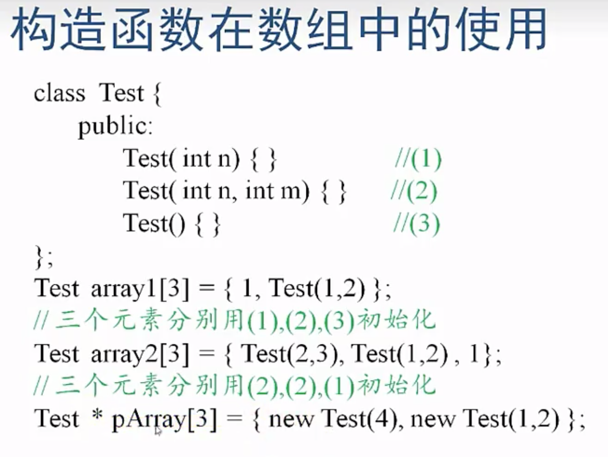
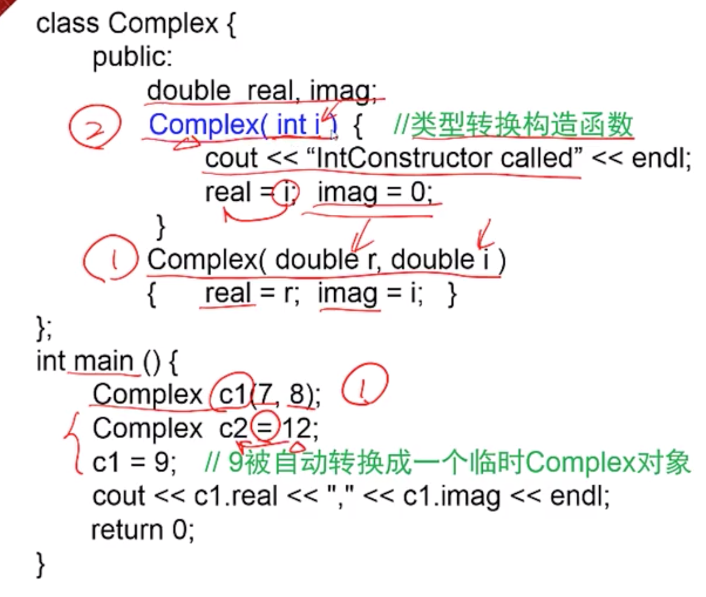
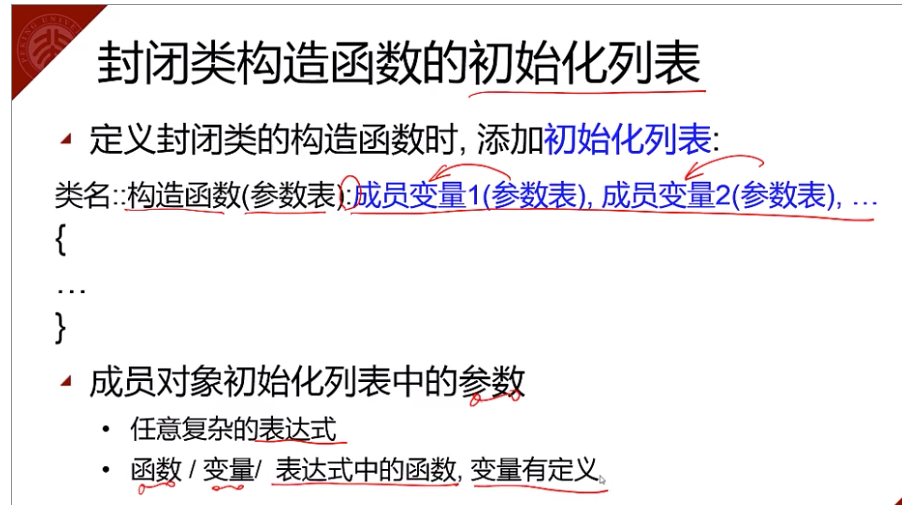

## Inline Function

Both two are inline functions.

```c++
class B {
    inline void func1();
    void func2() {
        
    };
}

void B::func1(){}
```

Only member function can allow you to have default values

you can also do it in hte contructor

```c++
void init(int x=0, int y=0)
```

**Compiler Error**

maksure you avoid this error

```c++
void valueX(int val=0){x=val;}
int valueX(){return x;}
```

**Constructor error**

Constructor does not any return value, not even void

```c++
/*
The follwoing would call the constructor, with one input paramter
*/
CSample array1[2] = {4, 5};
CSample array3[2] = {3}; //constructor one called, and constructor two called

CSample * array4 = new CSample[2]; //two empy constructors are called.
```



In the last case, pArray's third element has not been initialized.

## Copy Constructor

```c++
class Complex {
  public:
  	double real, imag;
  Complex(){}
  Complex(const Complex & c) {
    	real = c.real;
      image = c.image;
  		cout<<"Copy Constructor called";
  }
}
```

Case1

These two expressions are completely equivalent. This is the case where copy constructor would be called.

```c++
Complex c2(c1);
Complex c2 = c1;
```

Case 2

Function call will also incur copy constructor.

```c++
void Func(A al){}
```

Case 3

When an object A is returned, its copy constructor is required.

## Types of constructor

1. default constructor
2. copy constructor
3. destructor
4. conversion constructor function 
   1. (https://blog.csdn.net/qianqin_2014/article/details/51316461)
   2. https://stackoverflow.com/questions/15077466/what-is-a-converting-constructor-in-c-what-is-it-for



## Destructor

There is only one destructor.

It can have one name.

there is a default constructor, but it does not free any memory.

```c++
Demo d4(4);
d4 = 6; //this line id=6's constructor will be called, and then the destructor will be called again.
```

```c++
假设A是一个类的名字，下面的程序片段会类A的调用析构函数几次？

int main() {
     A * p = new A[2]; //在heap里的value，if you don't explictily free the memories, they would not be freed.
     A * p2 = new A;
     A a;
     delete [] p;

}
```

## Part 3 Static

Static member, and static functions

```c++
CRectangle::PrintTotal();//static memeber
r.PrintTotal();
p->PrintTotal();
CRectangle & ref = r;
int n = ref.nTotalNumber;
```

static member in the end is a global function.

```c++
class CRectangle {
    private:
    	int w, h;
    	static int nTotalArea;
    	static int nTotalNumber;
    public:
    	CRectangle(int w_, int h_);
    	static void PrintTotal();
}
```

You have to initialize static variable outside of the class.

<https://www.learncpp.com/cpp-tutorial/811-static-member-variables/>

static function cannot call any non static function or use any non static variable.

when you use reference count in the copy constructor, make sure you also make hte corresponding update on the copy constructor.


```c++
CTyre(int r, int w):radius(p), width(w) {

};

class CCar {
    private:
    	CTyre tyre;
   		CEngine engine;
   	public:
    	CCar(int p, int tr, int tw);
}

CCar::CCar(int p, int tr, int w):price(p), tyre(tr, w) {
    
};
```



## Part 4

Friend function

A class friend function can accesst its class private member.

Friend class

A is B's friend class: A's memeber function can visite B's private memebers.

There is no inheritance in friend class relationship.

```c++
class CCar; //提前声明 CCar类, 以便后面CDriver类使用
class CDriver {
public:
 void ModifyCar( CCar * pCar) ; //改装汽车
};
class CCar {
 private:
 int price;
 friend int MostExpensiveCar( CCar cars[], int total); //声明友元
 friend void CDriver::ModifyCar(CCar * pCar); //声明友元
};
```

This pointer

```c++
class A {
    int i;
    public:
    	void Hello() {
    		cout<<"Hello"<<endl;
    	}
   	//when the above function is converted to c function
    void Hello(A * this) {
        //this would not cause an error, if you did not use any of the member of the c++
    }
}
```

static function canoot use `this`

const function

```c++
class {
    void GetValue() const;
    //it cannot modify any member in the const func and it cannot modify any non const function.
}
```

a const object can call a const function.

you can do overload on the const function.

```
int b;
const int a = b; // ?
```

