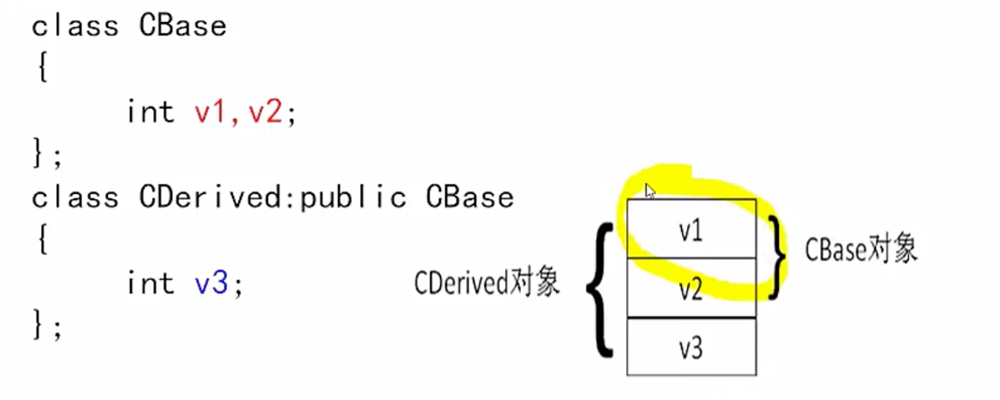

# Inheritance

derived class has all the private, protected, and public memebers. However, the derived class cannot access the private memebers.

```c++
class derived_class_name : public parent_class_name {
    private:
    	int nDepartment;
    public:
    	bool IsThreeGood(){......};//override
    	bool CanBaoYan(){...};
}
```



To call parent class

```c++
ParentClassName::parentfunc();
```

Composited Relationship: Circle and Point, there is no inheritance relationship 

chained definition, dog has a master, and master has dog

## Derived Class's constructor

```
it would run the base class constructor, and then the derived class.
```

```c++
class Bug {
    private:
    	int nLegs;
    	int nColor;
   public:
    	int nType;
    	Bug(int legs, int color);
    	void PrintBug() {};
}

class FlyBug:public Bug {
    FlyBug (int legs, int color): Bug(legs, color), {
		nWings = wings;
    }
}


```

```c++
base_class_var = derived based;
base & br = d;
base * pb = &d;
```

## Direct derivation, and indirect derivation

