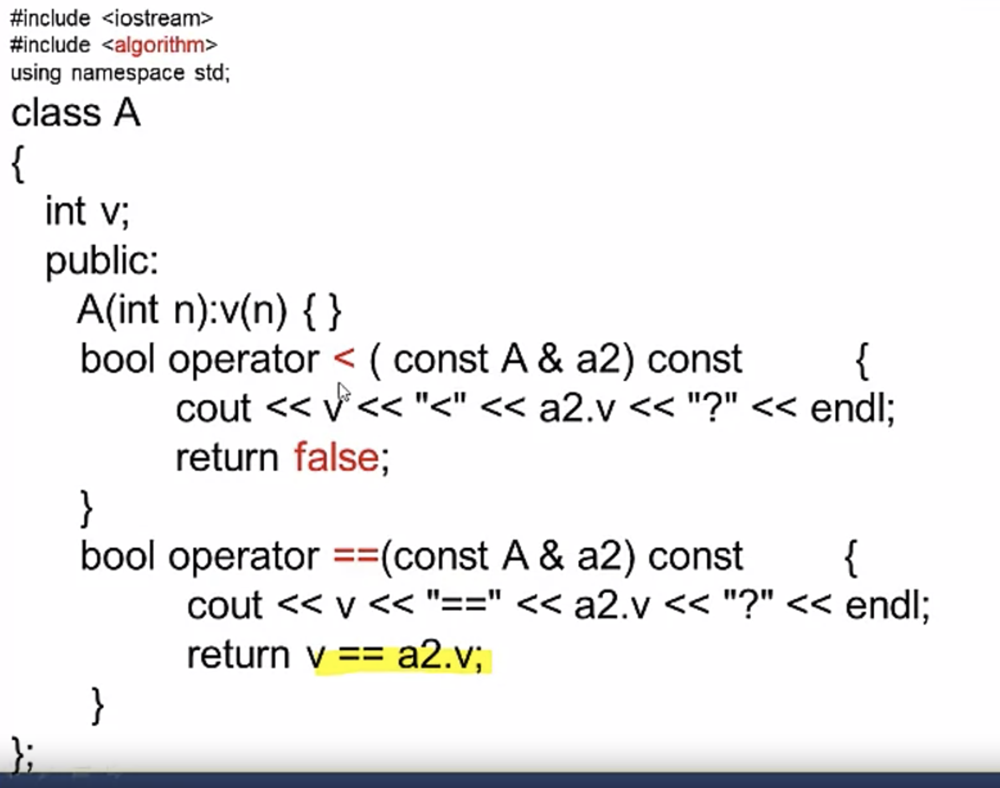

## STL

```c++
sort();
find();
```

`int array[100]` can be used as the iterator.

**顺序容器**

vector, <arraylist> in java 

deque (double ended queue): but this is continuous in the memory. adding and deletion in the middle is not continuous memory.

Therefore, they provide a functionality similar to [vectors](http://www.cplusplus.com/vector), but with efficient insertion and deletion of elements also at the beginning of the sequence, and not only at its end. But, unlike [vectors](http://www.cplusplus.com/vector), [deques](http://www.cplusplus.com/deque) are not guaranteed to store all its elements in contiguous storage locations: accessing elements in a `deque` by offsetting a pointer to another element causes *undefined behavior*.

Both [vectors](http://www.cplusplus.com/vector) and deques provide a very similar interface and can be used for similar purposes, but internally both work in quite different ways: While vectors use a single array that needs to be occasionally reallocated for growth, the elements of a deque can be scattered in different chunks of storage, with the container keeping the necessary information internally to provide direct access to any of its elements in constant time and with a uniform sequential interface (through iterators). Therefore, deques are a little more complex internally than [vectors](http://www.cplusplus.com/vector), but this allows them to grow more efficiently under certain circumstances, especially with very long sequences, where reallocations become more expensive.

 list, <linkedList>, it does not support random access

**关联容器**

set (does not allow for duplicate variables) this is equivalent of treeset in java

multiset, (duplicate values are allowed in this case)

map (is redblack tree where the key si sorted)

unordered_map (the keys are not sorted)

multimap

```
                 | map             | unordered_map
---------------------------------------------------------
Ordering        | increasing  order   | no ordering
                | (by default)        |

Implementation  | Self balancing BST  | Hash Table
                | like Red-Black Tree |  

search time     | log(n)              | O(1) -> Average 
                |                     | O(n) -> Worst Case

Insertion time  | log(n) + Rebalance  | Same as search
                      
Deletion time   | log(n) + Rebalance  | Same as search
```

**容器适配器**

stack, 

queue, 

priority_queue

### 

## Common member functions

```c++
begin(); //first element
end(); //the spot after the last element
rbegin(); //last element in the container
rend(); //the element before the first element
erase(); //delete first or multiple elements
clear(); //clear all the elements
```

##  unique to 顺序容器

`front`: reference to the first element

`back`: reference to the last element

`push_back`: add element to the end

pop_back: delete element at the end

`erase`: can make this element invalid 

## Iterator

very similar to pointer, it has const and non const iterators.

non const iterator can modify other elements.

`vector<int>::iterator varName`

`vector<int>::const_iterator varName`


```c++
template<class Inlt, class T> Int find(Inlt first, Inlt last, const T &val);
```

[first, last) <- the last is exclusive. If you did not find it, it is v.end();




## Vector

```c++
vector();
vector(int n);
vector(int n, const T & val);
vector(iterator first, iterator last);
```

### Operations

```c++
v.insert();
```

## List

```c++
push_front();
pop_front();
splice(); //similart to insert
listVar.sort();
```

you can override the operator to see whether they are equal.


dequeue does not have the member function sort.

## Function Object (函数对象)

One example of functional object sort.

When you override the operator `'()'` , you have the functional operator.

## set and multiset

